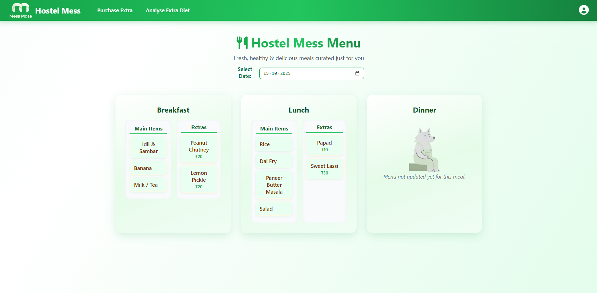
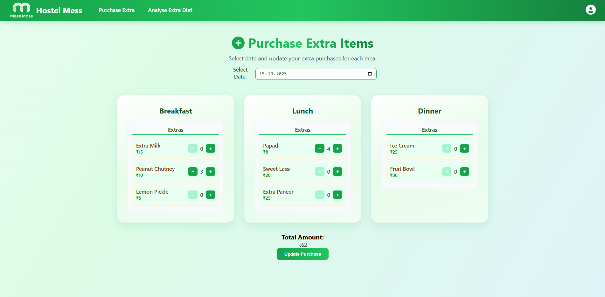
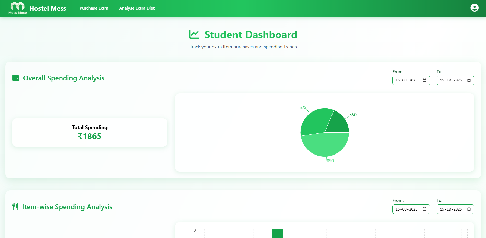

# Mess Mate – Smart Hostel Mess Companion

**Mess Mate** is a **React-based hostel mess management app** designed to help students **track daily meals, manage extra purchases, and analyze diet spending** — all in one place.

---

## ✨ Core Functionalities

* **Daily Mess Menu View** – Students can view their breakfast, lunch, and dinner menu in a clean, interactive UI.
* **Purchase Extras** – Allows students to log or view extra food purchases made beyond the regular mess plan.
* **Diet Analysis** – Visualize spending trends and meal choices with easy-to-understand analytics and charts.
* **Date-wise Filtering** – Select any date range to instantly fetch and filter data via API.
* **Responsive & Modern Design** – Fully optimized for mobile and desktop screens, with smooth animations and gradient backgrounds.

---

### Home Page

### Purchase Extras

### Analyze Diet

---

## 🧰 Technologies Used

* **MongoDB** – NoSQL database for storing meal records, extra purchases, and user data.

* **Express.js** – Backend framework for handling API routes and business logic.

* **React.js** – Frontend library for building dynamic and interactive user interfaces.

* **Node.js** – Runtime environment for running the backend efficiently.

---
